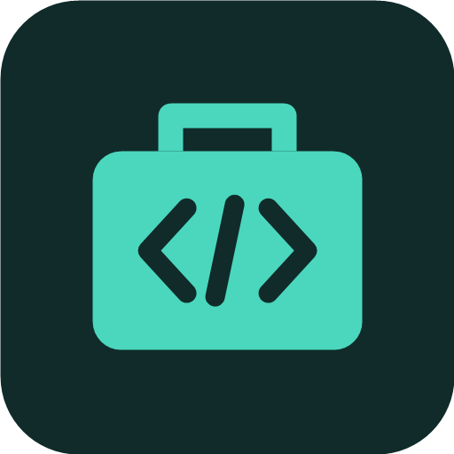

# Codex Toolkit



**Toolkit v0.1.0** · [MIT](LICENSE)

可獨立使用的 Python 工具、Codex Skills、Plugins 與 MCP 串接, 支援文件處理、Markdown 安全更新、程式碼盤點、工作規範與驗證證據整理

## 選擇使用方式

| 需求 | 入口 |
|---|---|
| 不使用 Codex, 直接執行工具 | [Python CLI](python-tools/README.md) |
| 在自己的 Python 程式使用核心 | [文件核心](python-tools/docs/python-document-core.md), [工作區核心](python-tools/docs/python-workspace-core.md) |
| 在 Codex 選用工作流程 | [Plugin 市集](docs/marketplace.md) 或 [獨立 Skills](docs/skills.md) |
| 用戶端需要結構化工具與受控存取 | [MCP 安裝與驗證](docs/mcp.md) |

## 快速開始

先複製儲存庫, 執行需要的入口

```text
git clone https://github.com/gaze9999/codex-toolkit.git
cd codex-toolkit
```

Python 工具需要 Python 3.10+, 列出工具不需先安裝全部文件套件

```text
python python-tools/launch-cli.py --list
python python-tools/launch-cli.py document-to-markdown --help
python python-tools/launch-cli.py documents.convert_to_markdown example.txt --dry-run
```

使用 PDF / Office 或其他選用功能時, 依 [工具說明](python-tools/README.md) 安裝所需相依套件. 輸入與輸出使用明確路徑, 有寫入影響的工具可先預覽

Codex 市集使用目前支援 Plugin 的用戶端, 加入來源後選擇需要的外掛

```text
codex plugin marketplace add gaze9999/codex-toolkit
codex plugin add codex-agent-workflow@codex-toolkit
```

市集提供 Skills 與資源, Jev 帳戶、MCP runtime 和選用工具依用途另外設定. 不同電腦各自管理憑證及執行環境, 詳細操作見 [市集教學](docs/marketplace.md)

Setup CLI 需要 Python 3.11+, Windows 使用 `launch-cli.cmd`, macOS / Linux 使用 `sh launch-cli.sh`, 先列出項目再選擇安裝

```text
launch-cli.cmd --help
launch-cli.cmd plugins --list
```

## 維護與教學

- [文件索引](docs/README.md): 安裝、工具選擇、MCP 與操作指引
- [元件維護規範](skills/agent-governance/references/component-authoring.md): Skill、reference、Python、Plugin 與 MCP 的責任
- [個人環境還原](docs/restore.md): Profile 選項、預覽、逐項套用與衝突處理
- [獨立 Python 使用](python-tools/docs/standalone.md): 脫離 Codex / 市集使用 CLI 或 wheel
- [Python 工具教學](python-tools/README.md): CLI、相依套件、範例與測試
- [Plugin 來源與封裝](docs/plugins.md): 自含資源、來源 hash 與驗證

可攜功能的來源在這份儲存庫, 個人設定保留於私人 `codex-setup`. `agents/` 是選用的通用範例, 套用前先預覽, 不代表作者的本機設定

## 檢查

```text
python -B mcp/scripts/audit_skills.py
python -B mcp/scripts/prepare_plugin_release.py --check
python -B mcp/scripts/prepare_marketplace.py --check
```

工具行為檢查按修改範圍選用 [Python 測試指引](python-tools/docs/testing.md). Windows 與 macOS 免安裝 CLI 由各自原生 Release 工作流程建置及驗證, 目前沒有新 `codex-toolkit` 的免安裝成品

## 授權

第一方程式碼與文件採 [MIT](LICENSE), 第三方套件與授權聲明見 [來源索引](docs/third-party.md)
